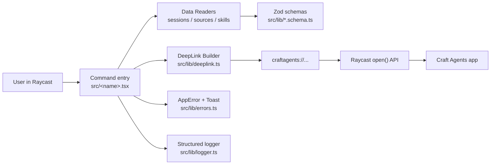
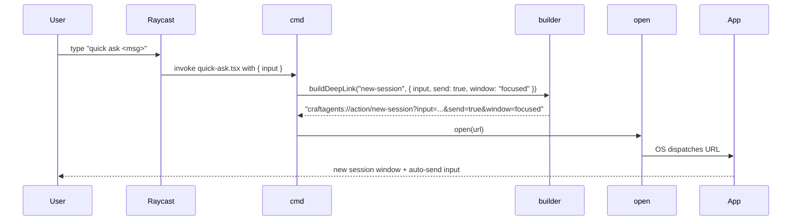
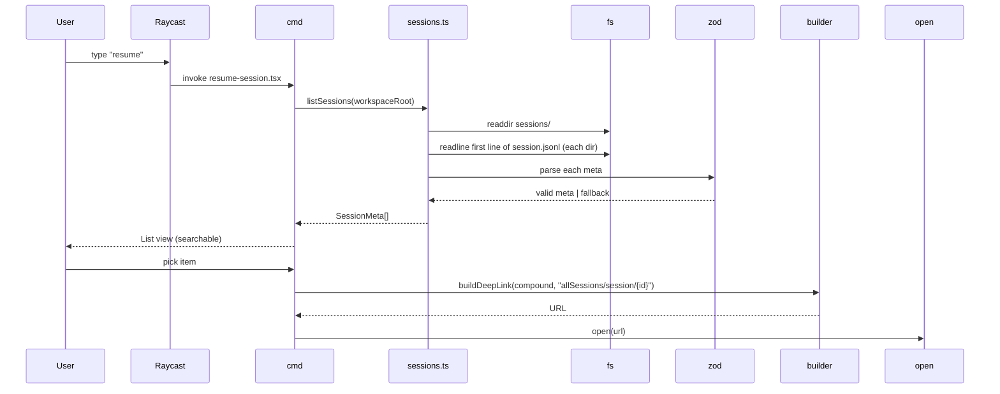

# Architecture

## 1. Layered structure

### Layer responsibilities

| Layer | Files | Responsibility |
|-------|-------|----------------|
| **Command** | `src/<name>.tsx` | Raycast entry point. Reads args/prefs, orchestrates. Keeps no business logic — delegates to lib/. |
| **DeepLink builder** | `src/lib/deeplink.ts` | Pure: build `craftagents://` URLs from typed params. Zero IO. |
| **Data readers** | `src/lib/sessions.ts`, `sources.ts`, `skills.ts` | Read filesystem under `workspaceRoot`, parse with Zod, tolerate malformed data. |
| **Schemas** | `src/lib/*.schema.ts` | Single source of truth for external data shape. Runtime + compile-time types. |
| **Cross-cutting** | `src/lib/errors.ts`, `logger.ts`, `workspace.ts` | `AppError`, structured logger, `workspaceRoot` resolution. |

## 2. Data flow (Quick Ask command)

## 3. Data flow (Resume Session command)

## 4. Key decisions

### D-1: No IPC with the app

The extension only writes deeplinks and reads the filesystem. No websockets, no MCP, no shared binary. Rationale: maximum decoupling. App version bumps only affect us at the deeplink contract and file-format layers, both of which are guarded by Zod + SPEC.md.

### D-2: Parse, don't validate

All filesystem data (`session.jsonl`, `config.json`, `SKILL.md` frontmatter) is parsed through Zod schemas with `.passthrough()` on metadata objects. Malformed rows are *skipped*, never throw. Rationale: one corrupt session shouldn't break the list.

### D-3: Raycast's ESLint over Biome

`@raycast/eslint-config` is required to pass `ray lint`, which is a hard prerequisite for the Raycast Store. Biome would force us to maintain a parallel config. `project-quality-init` skill explicitly permits the substitution.

### D-4: Release Please over Changesets

This is a single-package extension, not a monorepo. Release Please is zero-friction (no changeset files, relies on Conventional Commits), language-agnostic (no npm publish required), and produces clean GitHub Releases. See `docs/spec/release-process.md` (future).

### D-5: Session id = folder name

Sessions live at `{workspaceRoot}/sessions/{id}/`. The id is the folder name. `session.jsonl` first line is expected to contain metadata (name, labels, status, timestamps) but is treated as advisory — the folder name is the id of record.

## 5. Constraints

- **macOS only.** The `craftagents://` scheme is registered by the macOS app bundle. Windows/Linux builds of Craft Agents may expose a different scheme or none; not supported here.
- **Local filesystem access.** Raycast extensions run with the user's permissions and can read their workspace directory. The extension does not walk the tree deeply — only `sessions/*/session.jsonl` (first line), `sources/*/config.json`, `skills/*/SKILL.md` (frontmatter).
- **No network.** The extension does not make HTTP requests.
- **Single-window assumption.** Most deeplinks route to the currently-focused Craft Agents window. For users with multi-window setups, the `workspace/{id}` prefix (planned in Phase 9+) covers the gap.
